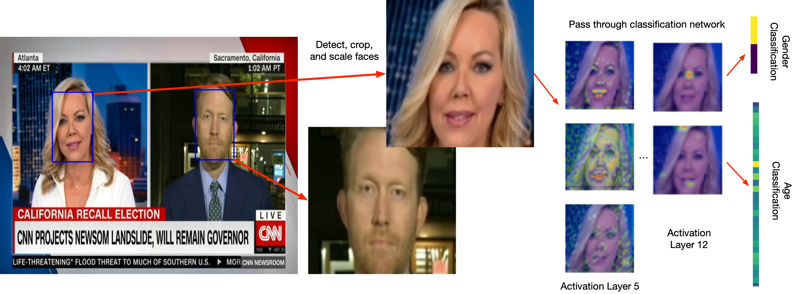

# Deep learning analysis of age and gender on TV
This repository contains code for the paper <TBD>.
It implements a performant analysis pipeline to extract faces from video files, scale them into a normalized representation, and estimate their age and gender.

We draw on pre-existing code from a series of projects:
- The [retinaface](https://github.com/deepinsight/insightface) model from insightface implements a high-performance face detection and landmark detection model
- To maintain comparability, we employ two pre-trained [ResNet architectures](https://github.com/yu4u/age-gender-estimation) whose performance on IMDB-Wiki and UTK was comparable to various self-trained models
- Fast parsing of video files is performed with [decord](https://github.com/dmlc/decord), a gpu-based video loading library for python

The pipeline is able to efficiently process large volumes of video material and produces estimates of age and gender of found faces along with metadata (detection confidence, bounding boxes):



## Technical prerequisites and replicability
Many of the python libraries used in this repository are not trivially usable on Windows and macOS computers. Please use a linux system (preferrably Ubuntu 20.04) to run the code. We also provide a Dockerfile to create a self-contained environment in which everything is set up and ready to use.

### Graphics cards
Deep learning is rather resource-intensive and therefore benefits from computing resources provided by graphics cards (gpus). The code in this repository should work without special hardware, but has been used exclusively with Nvidia gpus. If you do not have one installed on your system, set `GPU_ID = -1` in the file `face/retina.py`.

Despite their performance benefits, graphics cards complicate replicability due to the complexity of the involved software and tooling. Specific versions of python libraries need specific versions of Nvidia's own deep learning libraries (CUDA), which in turn need specific versions of drivers. The paper's results were obtained from a Ubuntu 20.04 system running CUDA 11.2. Building the docker image requires at least the same base version for the driver. Furthermore (and somewhat unintuitively), some libraries are not part of the container but instead need to be installed in the host system - notably nvcuvid files for gpu-accelerated decoding of videos. To make sure the drivers are matching (or exceeding) our baseline, add the official driver repository:

`sudo add-apt-repository ppa:graphics-drivers`

and then install the required apt packages for nvidia-470. A list of packages installed on our system can be found in `apt-nvidia-libraries.txt`.

### Docker image
To use the docker image, [install docker](https://docs.docker.com/engine/install/ubuntu/) to your linux computer (and [nvidia-docker](https://github.com/NVIDIA/nvidia-docker) to make use of Nvidia gpus), and run `docker build -t face-analysis -f face-gpu.Dockerfile .`. Then launch the image with `docker run --rm -it --gpus all -it face-analaysis /bin/bash`. Note that building the image requires a gpu, and the default docker executor needs to be set to nvidia. To do so, add the line `"default-runtime": "nvidia"` to /etc/docker/daemon.json and restart the docker daemon. If the system does not have a gpu, use `docker build -t face-analysis -f face-cpu.Dockerfile` instead.

### Library versions
Keeping with best practices, we have set up a `requirements.txt` file which lists the versions of python libraries we used. Where possible, we have directly included the relevant source files in our repository - this goes for the architecture of our classifier (in `wide_resnet.py`), the architecture of the face extraction model (`retinaface.py`), the face normalization (`retinaface_align.py`) and the models (`R50` for retinaface, `weights.28-3.73.hdf5` for the IMDB-wiki-classifier and `weights.29-3.76_utk.hdf5` for the UTK-classifier, all found in the `models` directory).

Note that due to disjoint requirements, installing precisely these versions may fail in the future, especially when using pip's new dependency lookup. Because mxnet (the deep learning framework used by retinaface) and tensorflow/keras (the deep learning framework used by the age/gender classifier) track different versions of libraries (numpy in particular), resulting conflicts can become unresolvable. In that case, it should still be possible to use a separate environment for mxnet-cu112 and tensorflow respectively.

## Running the code
Once all prerequisites are installed, video files may be placed in the `input` directory of this repository. Then run `python3 pipeline.py`. For each video, a tar file (without compression) is created containing the extracted faces. These tar files are then processed by the classifiers. The result are per-video TSV files in the `output` directory, which can be further analyzed in R. There are a couple of optional command line options:

- `--input` sets a directory from which to load video files
- `--output` sets the directory to which output data is written
- `--frames N` enables writing of annotated full frames (not just faces) to the output directories. These frames have identified faces annotated with a bounding box.

To run the included example, set up the docker container and run the following steps:  

```shell
docker run --rm --gpus all -it face-analaysis /bin/bash
python3 pipeline.py --input diagnosis --output output --frames 100
```


## Some notes on performance
Large-scale analyses of video material is bound to encounter several bottlenecks which have been worked around in this repository. We want to make these observations available in the hope that future research may benefit.

### Disk I/O
Video material takes up significant disk space; even our modest sample reached approximately 6TB of raw recordings. More importantly though, the individual images of extracted faces can easily overwhelm a disk system, either by using up all available inodes or by slowing down directory access. Possible solutions are  
(1) a tiered directory structure that stores images in subfolders named by tiered hash bytes (`123/456/789/123456789.jpg`),  
(2) directly analyzing faces without storing them on disk (this requires that all applicable neural networks fit into the gpu memory at once), and  
(3) our approach: Storing face images in an uncompressed tar per video file.

### Decoding videos
Decoding videos from their compressed source formats makes up a surprisingly large amount of the resources consumed by the overall pipeline, especially if sources are in h.264 or h.265 or other modern formats and/or exist in high resolution. Processing a one-hour segment can take up to several minutes, even on contemporary machines.

Decoding video is much faster when done by a modern gpu - that is why we include the [decord](https://github.com/dmlc/decord) library for gpu-accelerated video loading. Since gpu-based decoding has quite a few prerequisited, it's disabled by default. You can enable it by setting the decoding context in `face/retina.py`:
Switch `vr = VideoReader(str(video_path), ctx=cpu(0))` to  `vr = VideoReader(str(video_path), ctx=gpu(0))`.

Some care is still warranted in deciding for or against this technology.  
(1) gpu-based video decoders are not identical to software-based ones and do encounter more errors.  
(2) To decode a video, the file needs to be transferred from main memory to the gpu - a bottleneck that may slow down especially serial decoding of many small files.  
(3) Decoding on the gpu requires free memory; video files may be too large to be processed, especially when neural models are loaded at the same time.  
(4) In the past, there were several bugs in decord that would slow down random access to a video's frames; as a result, CPU parsing was faster.  
(5) When a fast CPU is available, it may be more efficient to perform video decoding on the CPU and leave the GPU free to simultatenously analyze results.

### Parallelization and handling gpu memory
Complex pipelines often include multiple neural networks (as ours does - retinaface and two wide resnets). But modern architectures also tend to be very large and require a lot of gpu memory. In between running these networks, the memory needs to be freed, or scripts will crash with an out of memory-error. It is sometimes still possible to run the entire pipeline in one go - by spawning child processes with `multiprocessing`, which in turn import the required libraries that set up the network. Note that this strategy may fail for mxnet when the library is not imported before creating additional processes.
Finally, memoization (caching finished results) is crucial; we included a simple file-based memoization utility in `utils.py`.

Optimal performance furthermore may require parallelization - i.e. running multiple neural networks at once on the same gpu, or spreading computation across multiple gpus. We did run our bulk analysis with parallel processes, but the details are too finnicky to offer them pre-made. The best strategy for efficient handling of very large volumes should be running each step of the pipeline as a separate process: The built-in memoziation will prevent repeated ingestion of already processed files, and each stage can independently watch for and work on new results. Do not hesitate to contact us for further details.
